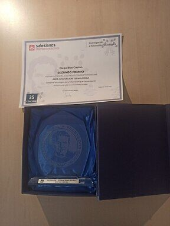

<p align="center">
 
</p>

# Decoinpay
Decoinpay fue presentado en la 35ª edición del premio Don Bosco en la categoría de Tecnologías de la Información y la Comunicación, obteniendo finalmente el 2º puesto como mejor proyecto.<br><br>
 
El proyecto se enfoca en el desarrollo de una aplicación web que permita tanto que las empresas puedan aceptar pagos con criptomonedas como que los usuarios puedan pagar con criptomonedas en cualquier negocio, a fin de facilitar la implementación de la tecnología blockchain en la sociedad. La aplicación cuenta con una interfaz intuitiva y fácil de usar, la cual permite tanto cobrar pagos como realizarlos de manera rápida y sencilla, también tiene un historial de todos los pagos tanto realizados como recibidos .<br><br>
 
Decoinpay también ofrece una API para poder aceptar pagos de forma online. Con esto, el uso de esta aplicación no te limita ya seas un negocio online como físico.
 
## Funcionamiento
La aplicación web está compuesta por un backend hecho con nodejs y express que integra una API para conectarse a la base de datos de MongoDB, y un frontend hecho en react y bootstrap. Todo unido con nginx para poder usar desde el mismo dominio el backend con "/api" y el frontend con "/"
 
## Tecnologías
React, Express, Mongoose, MongoDB, Node, Nginx, Docker, GitHub Actions, Bibliotecas de JavaScript: dotenv, crypto-js, ethers,
chart.js, axios, commander, cors y filesystem., Bootstrap, Git, DigitalOcean, Let’s Encrypt, 
 
## Instalación
Para poder usar este proyecto de forma local hay que unicamente tener instalado docker y docker compose, aparte de metamask como cartera de criptomonedas, el script de docker-compose.yml está configurado para que al poner en la consola una vez dentro de la carpeta del repositorio los siguientes comandos tener el proyecto activo en http://localhost:3000/
```bash
docker-compose build
```
```bash
docker-compose up
```
ADVERTENCIA: aunque el proyecto esté en local, sigue usando criptomonedas reales, si lo quieres probar al completo sin gastar tendrás que tener una blockchain local como Ganache.
 
## Recursos
Aquí dejo la foto del galardón y el diploma del premio recibido y la memoria del proyecto la cual se exigía una cantidad máxima de 25 páginas.<br><br>
<p align="center">
 
</p><br><br>
<p align="center">
 <a href="memoria.pdf">MEMORIA</a>
</p>
